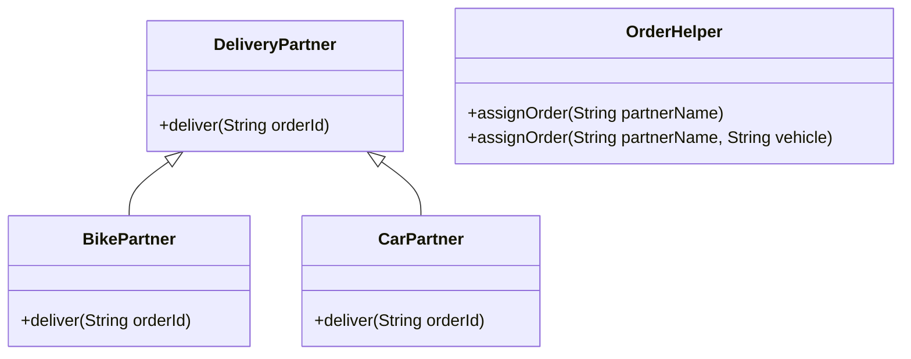
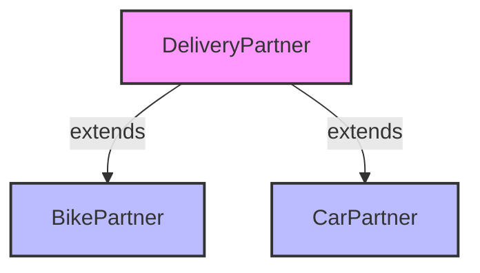

# Polymorphism in Java: Swiggy Delivery System



## Architecture Overview

### Runtime Polymorphism (Inheritance Hierarchy)


### Compile-time Polymorphism (Method Overloading)
```mermaid
flowchart LR
    A[OrderHelper] -->|1. assignOrder(String name)|
    A -->|2. assignOrder(String name, String vehicle)|
    
    style A fill:#9f9,stroke:#333,stroke-width:2px
```

## Types of Polymorphism Demonstrated

### 1. Compile-time Polymorphism (Method Overloading)
- **Location**: `OrderHelper` class
- **Example**:
  ```java
  public void assignOrder(String partnerName)
  public void assignOrder(String partnerName, String vehicle)
  ```
- **Explanation**: Multiple methods with the same name but different parameters in the same class.

### 2. Runtime Polymorphism (Method Overriding)
- **Location**: `DeliveryPartner` and its subclasses (`BikePartner`, `CarPartner`)
- **Example**:
  ```java
  // In DeliveryPartner class
  public void deliver(String orderId)
  
  // In BikePartner class
  @Override
  public void deliver(String orderId)
  
  // In CarPartner class
  @Override
  public void deliver(String orderId)
  ```
- **Explanation**: Child classes provide their own implementation of the parent class method.

## How to Run
1. Compile the Java file:
   ```bash
   javac SwiggyPolymorphism.java
   ```
2. Run the compiled class:
   ```bash
   java SwiggyPolymorphism
   ```

## Expected Output
```
Order assigned to delivery partner: Rahul
Order assigned to Priya with vehicle: Scooter
Delivering order ORDER123 using a Bike 🚴
Delivering order ORDER456 using a Car 🚗
```

## Real-world Application
This pattern is commonly used in:
- Payment processing systems (different payment methods)
- GUI frameworks (different UI components with common interface)
- Game development (different character behaviors)

## Benefits
- **Code Reusability**: Common interface for different implementations
- **Flexibility**: Easy to add new delivery methods
- **Maintainability**: Changes in one class don't affect others