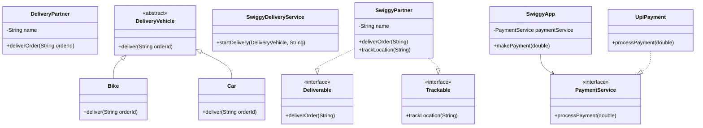

# SOLID Principles in Java: Swiggy Delivery System



## Architecture Overview

### 1. Single Responsibility Principle (SRP)


### 2. Open/Closed Principle (OCP)


### 3. Liskov Substitution Principle (LSP)


### 4. Interface Segregation Principle (ISP)


### 5. Dependency Inversion Principle (DIP)
```mermaid
flowchart TD
    A[SwiggyApp] -->|Depends on| B[PaymentService Interface]
    B <|-- C[UpiPayment]
    
    style A fill:#f9f,stroke:#333,stroke-width:2px
    style B fill:#9f9,stroke:#333,stroke-width:2px
    style C fill:#bbf,stroke:#333,stroke-width:2px
```

This project demonstrates the five SOLID principles of object-oriented programming using a Swiggy-like food delivery system as an example.

## 1. Single Responsibility Principle (SRP)
- **Class**: `DeliveryPartner`
- **Principle**: A class should have only one reason to change
- **Implementation**:
  ```java
  class DeliveryPartner {
      private String name;
      
      public void deliverOrder(String orderId) {
          System.out.println(name + " is delivering order " + orderId);
      }
  }
  ```
- **Benefit**: Each class has only one responsibility, making the code more maintainable.

## 2. Open/Closed Principle (OCP)
- **Classes**: `DeliveryVehicle` (abstract), `Bike`, `Car`
- **Principle**: Software entities should be open for extension but closed for modification
- **Implementation**:
  ```java
  abstract class DeliveryVehicle {
      public abstract void deliver(String orderId);
  }
  
  class Bike extends DeliveryVehicle { /* ... */ }
  class Car extends DeliveryVehicle { /* ... */ }
  ```
- **Benefit**: New vehicle types can be added without modifying existing code.

## 3. Liskov Substitution Principle (LSP)
- **Class**: `SwiggyDeliveryService`
- **Principle**: Objects of a superclass should be replaceable with objects of its subclasses
- **Implementation**:
  ```java
  public void startDelivery(DeliveryVehicle vehicle, String orderId) {
      vehicle.deliver(orderId); // works with any DeliveryVehicle subclass
  }
  ```
- **Benefit**: Ensures that a subclass can stand in for its parent class.

## 4. Interface Segregation Principle (ISP)
- **Interfaces**: `Deliverable`, `Trackable`
- **Principle**: Clients shouldn't be forced to depend on interfaces they don't use
- **Implementation**:
  ```java
  interface Deliverable { void deliverOrder(String orderId); }
  interface Trackable { void trackLocation(String partnerName); }
  
  class SwiggyPartner implements Deliverable, Trackable { /* ... */ }
  ```
- **Benefit**: Clients only need to know about the methods that are of interest to them.

## 5. Dependency Inversion Principle (DIP)
- **Classes**: `PaymentService`, `UpiPayment`, `SwiggyApp`
- **Principle**: Depend on abstractions, not on concrete classes
- **Implementation**:
  ```java
  interface PaymentService { void processPayment(double amount); }
  
  class SwiggyApp {
      private PaymentService paymentService;
      public SwiggyApp(PaymentService paymentService) {
          this.paymentService = paymentService;
      }
  }
  ```
- **Benefit**: Makes the system more flexible and easier to modify.

## How to Run
1. Compile the Java file:
   ```bash
   javac SwiggySOLID.java
   ```
2. Run the compiled class:
   ```bash
   java SwiggySOLID
   ```

## Expected Output
```
Rahul is delivering order ORDER101
Delivering order ORDER102 using Bike 🚴
Delivering order ORDER103 using Car 🚗
Priya delivered order ORDER104
Tracking location of Priya...
Payment of Rs.299.0 done via UPI ✅
```

## Real-world Applications
- **SRP**: Microservices architecture
- **OCP**: Plugin architectures
- **LSP**: Collections framework in Java
- **ISP**: Adapter pattern implementations
- **DIP**: Dependency injection frameworks

## Benefits of SOLID Principles
- Improved code maintainability
- Easier to extend
- More testable code
- Reduced coupling between components
- Better code organization
