# Abstract Factory Pattern

## 🏗️ Architecture Overview

```mermaid
classDiagram
    %% Abstract Products
    class MainCourse {
        <<interface>>
        +serve() String
    }
    
    class Beverage {
        <<interface>>
        +serve() String
    }
    
    %% Concrete Products
    class VegMainCourse {
        +serve() String
    }
    
    class NonVegMainCourse {
        +serve() String
    }
    
    class VegBeverage {
        +serve() String
    }
    
    class NonVegBeverage {
        +serve() String
    }
    
    %% Abstract Factory
    class MealFactory {
        <<interface>>
        +createMain() MainCourse
        +createBeverage() Beverage
    }
    
    %% Concrete Factories
    class VegMealFactory {
        +createMain() MainCourse
        +createBeverage() Beverage
    }
    
    class NonVegMealFactory {
        +createMain() MainCourse
        +createBeverage() Beverage
    }
    
    %% Relationships
    MealFactory <|-- VegMealFactory
    MealFactory <|-- NonVegMealFactory
    
    MainCourse <|-- VegMainCourse
    MainCourse <|-- NonVegMainCourse
    Beverage <|-- VegBeverage
    Beverage <|-- NonVegBeverage
    
    VegMealFactory --> VegMainCourse : creates
    VegMealFactory --> VegBeverage : creates
    NonVegMealFactory --> NonVegMainCourse : creates
    NonVegMealFactory --> NonVegBeverage : creates
    
    %% Styling for dark theme
    classDef interface fill:#1e3a1e,stroke:#10b981,color:#e0e0e0,stroke-width:2px
    classDef concrete fill:#1e3a8a,stroke:#3b82f6,color:#e0e0e0,stroke-width:2px
    classDef factory fill:#5b21b6,stroke:#8b5cf6,color:#e0e0e0,stroke-width:2px
    
    %% Apply styles to individual classes
    class MainCourse interface
    class Beverage interface
    class MealFactory interface
    
    class VegMainCourse concrete
    class NonVegMainCourse concrete
    class VegBeverage concrete
    class NonVegBeverage concrete
    
    class VegMealFactory factory
    class NonVegMealFactory factory
```



## 🚀 How It Works

The Abstract Factory pattern provides an interface for creating families of related or dependent objects without specifying their concrete classes.

### Key Components

1. **Abstract Products** (`MainCourse`, `Beverage`)
   - Declare interfaces for a set of distinct but related products.

2. **Concrete Products** (`VegMainCourse`, `NonVegMainCourse`, `VegBeverage`, `NonVegBeverage`)
   - Implement the abstract product interfaces.

3. **Abstract Factory** (`MealFactory`)
   - Declares a set of methods for creating each of the abstract products.

4. **Concrete Factories** (`VegMealFactory`, `NonVegMealFactory`)
   - Implement the operations to create concrete product objects.

## 🛠️ Usage

```java
// Create factories
MealFactory vegFactory = new VegMealFactory();
MealFactory nonVegFactory = new NonVegMealFactory();

// Create complete meals
String vegMeal = vegFactory.createMain().serve() + " with " + vegFactory.createBeverage().serve();
String nonVegMeal = nonVegFactory.createMain().serve() + " with " + nonVegFactory.createBeverage().serve();

System.out.println("Veg Meal: " + vegMeal);
System.out.println("Non-Veg Meal: " + nonVegMeal);
```

## 📊 Sequence Diagram


## ✅ When to Use

- When a system should be independent of how its products are created, composed, and represented
- When a system should be configured with multiple families of products
- When you need to enforce that a family of related products must be used together

## 📝 Notes

- Follows the Open/Closed Principle: You can introduce new variants of products without breaking existing client code.
- Follows the Single Responsibility Principle: The product creation code is extracted to one place, making the code easier to support.
- Follows the Dependency Inversion Principle: High-level modules depend on abstractions, not concrete classes.
