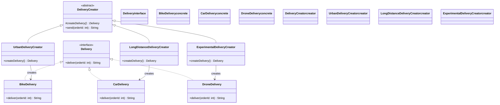

# Factory Method Pattern

## 🏗️ Architecture Overview



## 🚀 How It Works

The Factory Method pattern defines an interface for creating an object, but lets subclasses decide which class to instantiate. It lets a class defer instantiation to subclasses.

### Key Components

1. **Product** (`Delivery`)
   - Defines the interface of objects the factory method creates.

2. **Concrete Products** (`BikeDelivery`, `CarDelivery`, `DroneDelivery`)
   - Implement the Product interface.

3. **Creator** (`DeliveryCreator`)
   - Declares the factory method that returns an object of type Product.

4. **Concrete Creators** (`UrbanDeliveryCreator`, `LongDistanceDeliveryCreator`, `ExperimentalDeliveryCreator`)
   - Override the factory method to return an instance of a ConcreteProduct.

## 🛠️ Usage

```java
// Create creators
DeliveryCreator urban = new UrbanDeliveryCreator();
DeliveryCreator longDist = new LongDistanceDeliveryCreator();
DeliveryCreator drone = new ExperimentalDeliveryCreator();

// Use creators to create and use products
System.out.println(urban.send(101));
System.out.println(longDist.send(202));
System.out.println(drone.send(303));
```

## 📊 Sequence Diagram


## ✅ When to Use

- When a class can't anticipate the class of objects it must create
- When a class wants its subclasses to specify the objects it creates
- When classes delegate responsibility to one of several helper subclasses, and you want to localize the knowledge of which helper subclass is the delegate

## 📝 Notes

- Follows the Open/Closed Principle: You can introduce new types of products into the program without breaking existing client code.
- Avoids tight coupling between the creator and the concrete products.
- Single Responsibility Principle: The product creation code is in one place in the program, making the code easier to support.
