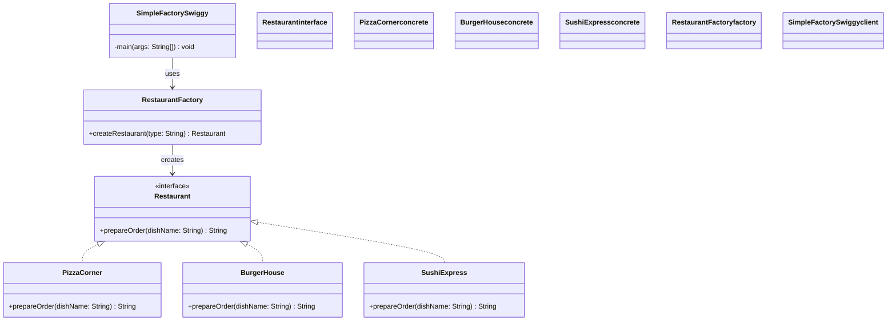
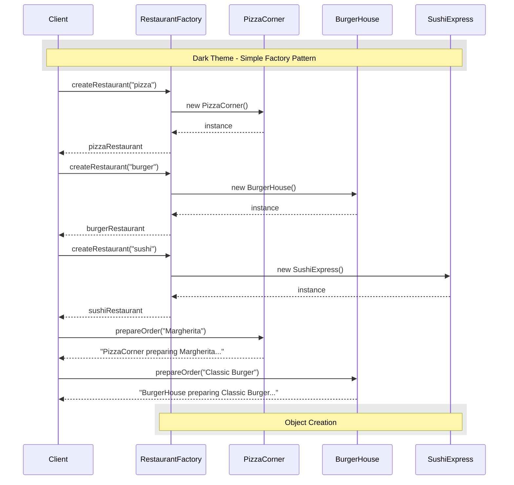

# Simple Factory Pattern

## 🏗️ Architecture Overview



## 🚀 How It Works

The Simple Factory pattern encapsulates object creation in one place, providing a single point for object creation without exposing the instantiation logic to the client.

### Key Components

1. **Product** (`Restaurant`)
   - Defines the interface of objects the factory creates.

2. **Concrete Products** (`PizzaCorner`, `BurgerHouse`, `SushiExpress`)
   - Implement the Product interface.

3. **Factory** (`RestaurantFactory`)
   - Contains the logic to create and return appropriate product instances.

4. **Client** (`SimpleFactorySwiggy`)
   - Uses the factory to create products, but doesn't know about the concrete classes.

## 🛠️ Usage

```java
// Using the factory to create restaurant instances
Restaurant pizzaRestaurant = RestaurantFactory.createRestaurant("pizza");
Restaurant burgerRestaurant = RestaurantFactory.createRestaurant("burger");
Restaurant sushiRestaurant = RestaurantFactory.createRestaurant("sushi");

// Using the created instances
System.out.println(pizzaRestaurant.prepareOrder("Margherita"));
System.out.println(burgerRestaurant.prepareOrder("Classic Burger"));
System.out.println(sushiRestaurant.prepareOrder("California Roll"));
```

## 📊 Sequence Diagram



## ✅ When to Use

- When object creation logic is complex or involves conditional logic
- When you want to provide a simple way to create objects without exposing the creation logic
- When you have a small number of product classes that don't form a hierarchy

## 📝 Notes

- **Pros**:
  - Encapsulates object creation
  - Decouples client code from concrete classes
  - Makes code more maintainable and easier to test
  
- **Cons**:
  - Can become complex if there are many different product types
  - Adding new products requires modifying the factory class (violates Open/Closed Principle)
  
- **Difference from Factory Method**: Simple Factory handles object creation in one method, while Factory Method uses inheritance and relies on subclasses to handle the object instantiation.

## 🔄 Comparison with Other Patterns

| Pattern | Description | When to Use |
|---------|-------------|-------------|
| **Simple Factory** | A single factory class with a method to create objects | When object creation is simple and won't change frequently |
| **Factory Method** | Defers instantiation to subclasses | When a class can't anticipate the class of objects it must create |
| **Abstract Factory** | Creates families of related objects | When you need to create families of related or dependent objects |
