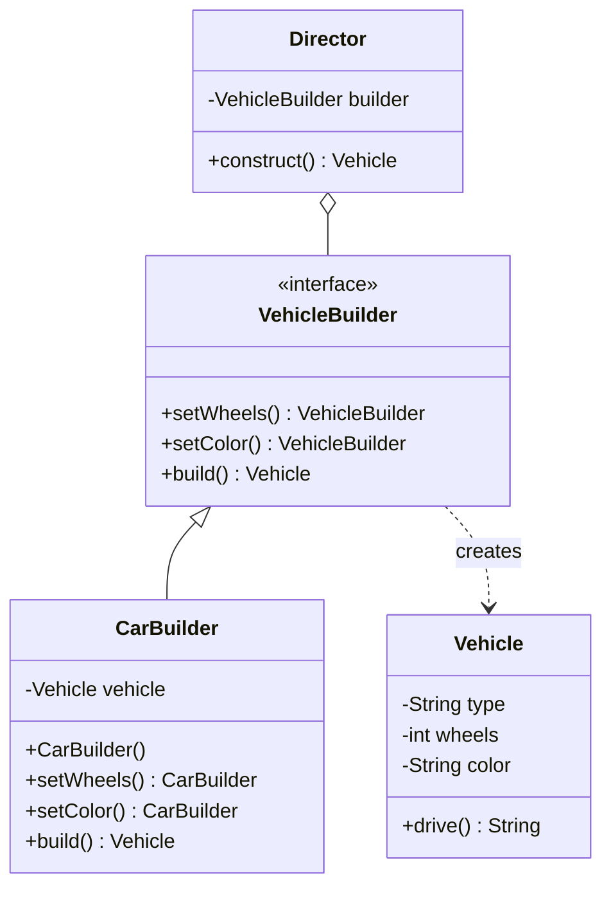

# Builder Design Pattern

## 🏗️ Overview
The Builder pattern separates the construction of a complex object from its representation, allowing the same construction process to create different representations.

## 📊 Architecture



## 🎯 When to Use
- When an object needs to be created with many optional components
- When you want to create different representations of an object
- When the construction process should be independent of the components

## ✅ Pros
- Encapsulates code for construction
- Allows control over the construction process
- Provides clear separation between construction and representation
- Supports building different representations

## ❌ Cons
- Requires creating separate Builder classes
- Slightly more complex than using constructors directly

## 🔍 Real-world Analogy
Think of building a custom computer - you can choose different components (CPU, RAM, etc.) to create different configurations of the same computer model.

## 🛠️ Implementation Details
- Product class (what's being built)
- Builder interface/abstract class
- Concrete builder classes
- Optional Director class for complex builds

## 📝 Example Usage
```java
VehicleBuilder builder = new CarBuilder();
Vehicle car = builder.setWheels(4)
                    .setColor("Red")
                    .build();
```
