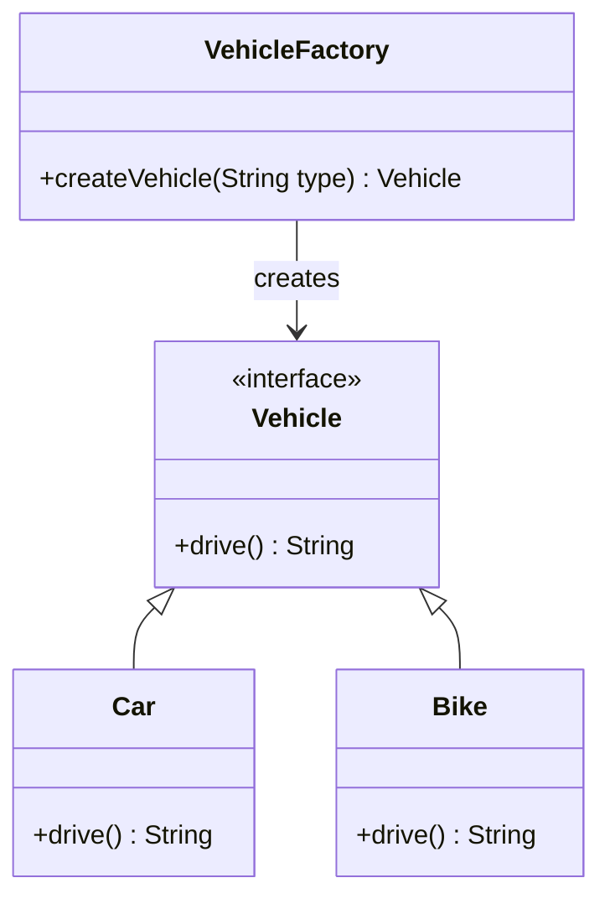

# Factory Design Pattern

## 🏗️ Overview
The Factory pattern defines an interface for creating objects but lets subclasses alter the type of objects that will be created.

## 📊 Architecture



## 🎯 When to Use
- When you don't know beforehand what type of objects you need
- When you want to delegate the responsibility of object creation to subclasses
- When you want to provide a way to extend the type of objects being created

## ✅ Pros
- Decouples object creation from object use
- Makes adding new product types easier
- Centralizes the product creation code
- Follows the Open/Closed Principle

## ❌ Cons
- Can introduce unnecessary complexity
- May require creating many new subclasses

## 🔍 Real-world Analogy
Think of a car factory - the same factory can produce different models of cars based on customer requirements, but the process of building each car follows the same basic steps.

## 🛠️ Implementation Details
- Product interface/abstract class
- Concrete product classes
- Factory class with creation method
- Client code that uses the factory

## 📝 Example Usage
```java
VehicleFactory factory = new VehicleFactory();
Vehicle vehicle = factory.createVehicle("car");
String result = vehicle.drive();
```
