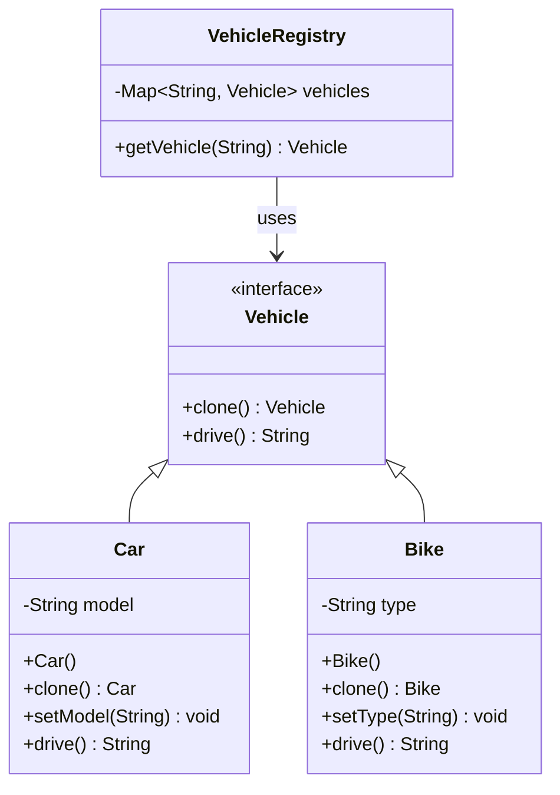

# Prototype Design Pattern

## 🏗️ Overview
The Prototype pattern creates new objects by copying an existing object, known as the prototype, rather than creating new instances from scratch.

## 📊 Architecture



## 🎯 When to Use
- When the classes to instantiate are specified at runtime
- When you want to avoid building a class hierarchy of factories
- When instances of a class can have only a few different combinations of state

## ✅ Pros
- Hides the complexity of making new instances from the client
- Can add and remove products at runtime
- Reduces the need for subclassing
- Improves performance by cloning objects

## ❌ Cons
- Complex object copying can be tricky to implement
- May require deep copying for objects with references

## 🔍 Real-world Analogy
Think of a cell dividing - each new cell is a clone of the original, with the same genetic material but can develop differently based on its environment.

## 🛠️ Implementation Details
- Prototype interface with clone method
- Concrete prototype classes
- Client code that creates new objects by copying
- Registry for managing prototypes

## 📝 Example Usage
```java
// Get a car from the registry
Vehicle car1 = VehicleRegistry.getVehicle("car");
car1.setModel("Sedan");

// Clone the car
Vehicle car2 = car1.clone();
```
