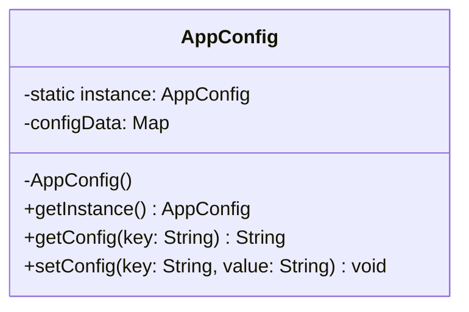

# Singleton Design Pattern

## 🏗️ Overview
The Singleton pattern ensures that a class has only one instance and provides a global point of access to that instance.

## 📊 Architecture



## 🎯 When to Use
- When exactly one instance of a class is required
- When you need controlled access to a single instance
- Common use cases: Configuration management, logging, database connections

## ✅ Pros
- Controlled access to the sole instance
- Reduced namespace pollution
- Can be lazy-loaded
- Thread-safe implementation

## ❌ Cons
- Can be difficult to unit test
- Violates Single Responsibility Principle
- Requires special handling in multithreaded environments

## 🔍 Real-world Analogy
Think of a government - there's only one president at a time, and that president is the single point of contact for certain decisions.

## 🛠️ Implementation Details
- Private constructor to prevent instantiation
- Static method to get the instance
- Thread-safe initialization
- Lazy loading support

## 📝 Example Usage
```java
// Getting the singleton instance
AppConfig config = AppConfig.getInstance();

// Using the configuration
String dbUrl = config.getConfig("database.url");
```
