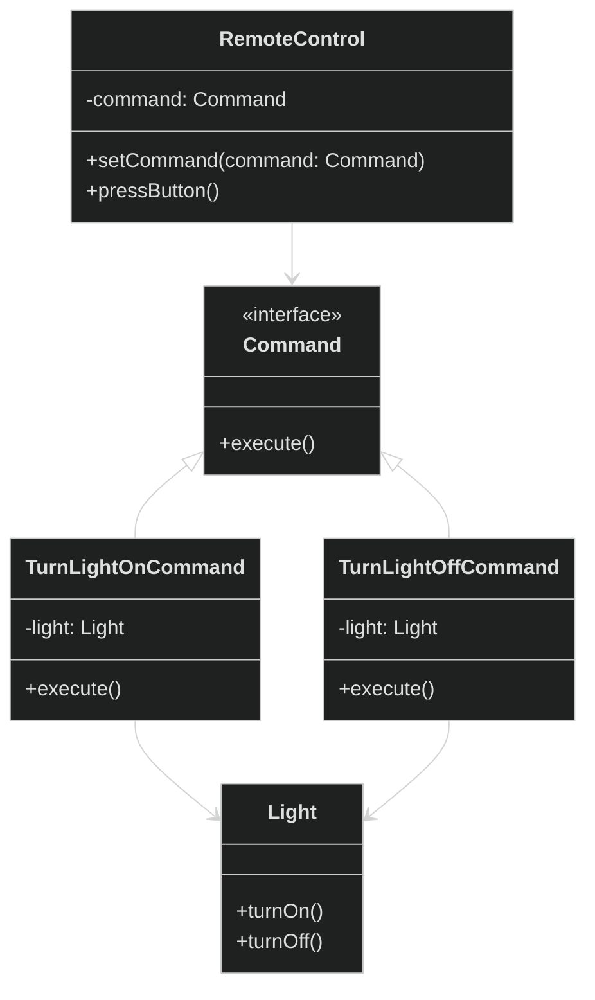

# Command Design Pattern

<div style="background-color: #1e1e1e; padding: 20px; border-radius: 8px; color: #e0e0e0;">

## 🏗️ Overview
Encapsulate a request as an object, thereby letting you parameterize clients with different requests, queue or log requests, and support undoable operations.

## 📊 Architecture



## 🎯 When to Use
- Need to parameterize objects by an action to perform
- Need to decouple sender from receiver
- Need to support queuing, logging, or undoable operations
- Need to support callback functionality

## ✅ Pros
- Decouples the invoker (RemoteControl) from the receiver (Light)
- New commands can be added without changing existing code
- Commands can be queued, logged, or undone
- Follows Single Responsibility and Open/Closed principles

## ❌ Cons
- Can lead to an increase in the number of classes
- May complicate the code if you only need a simple command

## 🔍 Real-world Analogy
Think of a restaurant order. The waiter (Invoker) takes the order (Command) from the customer and gives it to the chef (Receiver) who prepares the meal. The waiter doesn't need to know how to prepare the food, just what was ordered.

## 🛠️ Implementation Details
- `Command` interface declares the execution method
- Concrete command classes implement the command interface
- Invoker asks the command to carry out the request
- Receiver knows how to perform the operations

## Example Usage
```java
// Create the receiver
Light light = new Light();

// Create commands
Command turnOn = new TurnLightOnCommand(light);
Command turnOff = new TurnLightOffCommand(light);

// Create invoker
RemoteControl remote = new RemoteControl();

// Turn ON
remote.setCommand(turnOn);
remote.pressButton();
remote.onButtonWasPushed(0);
```

## 🌟 Key Points
- Commands are objects that encapsulate a request
- Can support undo by maintaining state
- Can be queued or logged
- Can support transactions

</div>

<style>
  body {
    background-color: #1e1e1e;
    color: #e0e0e0;
  }
  h1, h2, h3, h4, h5, h6 {
    color: #4ec9b0;
  }
  code {
    background-color: #2d2d2d;
    color: #d4d4d4;
  }
  pre {
    background-color: #2d2d2d;
    border-radius: 4px;
    padding: 12px;
  }
</style>
