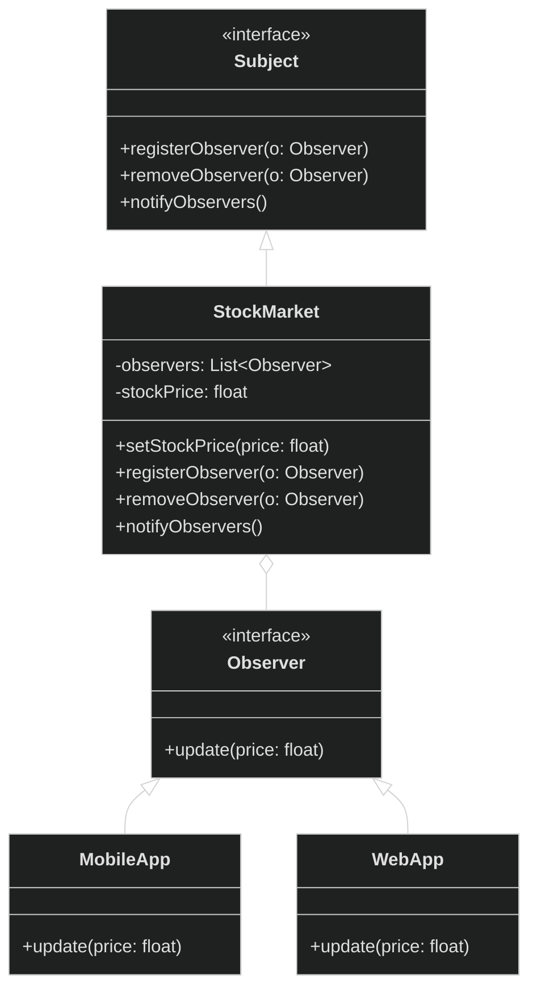

# Observer Design Pattern

<div style="background-color: #1e1e1e; padding: 20px; border-radius: 8px; color: #e0e0e0;">

## 🏗️ Overview
Define a one-to-many dependency between objects so that when one object changes state, all its dependents are notified and updated automatically.

## 📊 Architecture



## 🎯 When to Use
- When changes to one object require changing other objects
- When an object should be able to notify other objects without making assumptions about who those objects are
- In event handling, listeners, UI updates, stock price trackers, and notification systems

## ✅ Pros
- Loose coupling between Subject and Observer
- Support for broadcast communication
- Dynamic relationship between objects
- Follows Open/Closed Principle

## ❌ Cons
- Notification can be inefficient if many observers
- Can cause memory leaks if observers aren't properly removed
- Update order isn't specified, which can lead to subtle bugs

## 🔍 Real-world Analogy
Think of a stock market ticker. When a stock price changes, all subscribed applications (mobile, web, etc.) are automatically updated with the new price. The stock market doesn't need to know about the specific applications, just that they need to be notified of price changes.

## 🛠️ Implementation Details
- `Subject` interface manages the observers (register, remove, notify)
- `Observer` interface defines the update method for notifications
- `StockMarket` is the concrete subject that maintains stock price and notifies observers
- `MobileApp` and `WebApp` are concrete observers that receive updates

## 📝 Example Usage
```java
// Create subject (publisher)
StockMarket stock = new StockMarket();

// Create observers (subscribers)
Observer mobileApp = new MobileApp();
Observer webApp = new WebApp();

// Register observers
stock.registerObserver(mobileApp);
stock.registerObserver(webApp);

// Update stock price (triggers notifications)
System.out.println("Setting stock price to 120.5");
stock.setStockPrice(120.5f);   // Both observers get update

// Remove an observer
System.out.println("\nRemoving WebApp Observer...");
stock.removeObserver(webApp);  // WebApp unsubscribes

// Update again (only MobileApp gets notified)
System.out.println("\nSetting stock price to 125.75");
stock.setStockPrice(125.75f);

## 🌟 Key Points
- The `StockMarket` maintains a list of observers and notifies them of price changes
- Observers (`MobileApp`, `WebApp`) implement the `Observer` interface
- New observer types can be added without modifying the `StockMarket` class
- Observers can subscribe/unsubscribe at runtime
- The subject doesn't need to know the concrete classes of its observers

</div>

<style>
  body {
    background-color: #1e1e1e;
    color: #e0e0e0;
  }
  h1, h2, h3, h4, h5, h6 {
    color: #4ec9b0;
  }
  code {
    background-color: #2d2d2d;
    color: #d4d4d4;
  }
  pre {
    background-color: #2d2d2d;
    border-radius: 4px;
    padding: 12px;
  }
</style>
