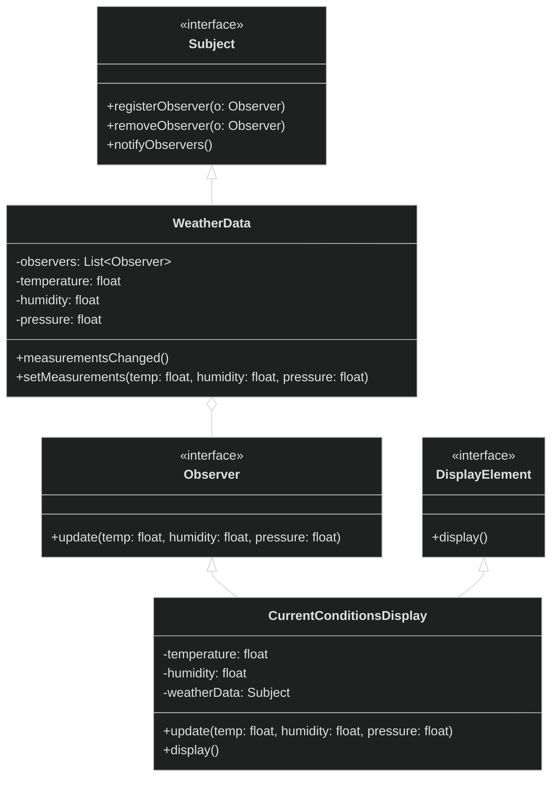

# Observer Design Pattern

<div style="background-color: #1e1e1e; padding: 20px; border-radius: 8px; color: #e0e0e0;">

## 🏗️ Overview
Define a one-to-many dependency between objects so that when one object changes state, all its dependents are notified and updated automatically.

## 📊 Architecture



## 🎯 When to Use
- When an abstraction has two aspects, one dependent on the other
- When a change to one object requires changing others
- When an object should be able to notify other objects without making assumptions about who those objects are

## ✅ Pros
- Loose coupling between Subject and Observer
- Support for broadcast communication
- Dynamic relationship between objects
- Follows Open/Closed Principle

## ❌ Cons
- Notification can be inefficient if many observers
- Can cause memory leaks if observers aren't properly removed
- Update order isn't specified, which can lead to subtle bugs

## 🔍 Real-world Analogy
Think of a news subscription service. When a new edition of a newspaper comes out, all subscribers receive it. The publisher doesn't need to know who the subscribers are, just that they need to be notified of new editions.

## 🛠️ Implementation Details
- `Subject` interface manages the observers
- `Observer` interface defines the update method
- Concrete subjects implement the subject interface
- Concrete observers implement the observer interface

## 📝 Example Usage
```java
// Create the subject
WeatherData weatherData = new WeatherData();

// Create observers
CurrentConditionsDisplay currentDisplay = 
    new CurrentConditionsDisplay(weatherData);

// Simulate new weather measurements
weatherData.setMeasurements(80, 65, 30.4f);
weatherData.setMeasurements(82, 70, 29.2f);
weatherData.setMeasurements(78, 90, 29.2f);
```

## 🌟 Key Points
- Subjects know their observers through a common interface
- Observers are loosely coupled to the subject
- Can add/remove observers at runtime
- Avoids polling for changes

</div>

<style>
  body {
    background-color: #1e1e1e;
    color: #e0e0e0;
  }
  h1, h2, h3, h4, h5, h6 {
    color: #4ec9b0;
  }
  code {
    background-color: #2d2d2d;
    color: #d4d4d4;
  }
  pre {
    background-color: #2d2d2d;
    border-radius: 4px;
    padding: 12px;
  }
</style>
