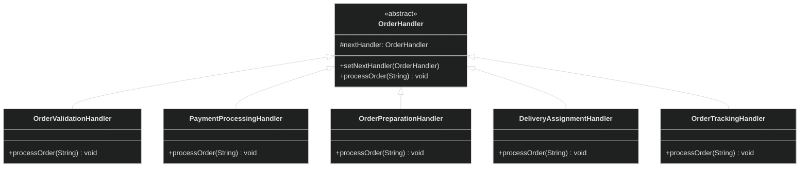

# Chain of Responsibility Design Pattern

<div style="background-color: #1e1e1e; padding: 20px; border-radius: 8px; color: #e0e0e0;">

## 🏗️ Overview
Chain of Responsibility is a behavioral design pattern that lets you pass requests along a chain of handlers. Upon receiving a request, each handler decides either to process the request or to pass it to the next handler in the chain.

## 📊 Architecture



## 🎯 When to Use
- When you want to decouple sender and receiver of a request
- When multiple objects should be able to handle a request
- When the handler isn't known in advance
- When you want to process a request in a specific order

## ✅ Pros
- Reduces coupling between sender and receiver
- Allows dynamic addition or removal of handlers
- Follows Single Responsibility Principle
- Follows Open/Closed Principle

## ❌ Cons
- Requests can go unhandled if there's no catch-all handler
- Can be hard to debug the flow of requests

## 🔍 Real-world Analogy
Think of a customer support ticket system where a request goes through multiple levels (L1 → L2 → Manager) until someone can handle it, or a food delivery order flow (Validate → Pay → Prepare → Deliver → Track).

## 🛠️ Implementation Details
- `OrderHandler` is the base handler interface
- Concrete handlers implement the processing logic
- Each handler has a reference to the next handler
- Handlers can decide to process the request and/or pass it to the next handler

## 📝 Example Usage
```java
// Create the chain of handlers
OrderHandler validation = new OrderValidationHandler();
OrderHandler payment = new PaymentProcessingHandler();
OrderHandler preparation = new OrderPreparationHandler();
OrderHandler delivery = new DeliveryAssignmentHandler();
OrderHandler tracking = new OrderTrackingHandler();

// Set up the chain
validation.setNextHandler(payment);
payment.setNextHandler(preparation);
preparation.setNextHandler(delivery);
delivery.setNextHandler(tracking);

// Process an order
validation.processOrder("Pizza Margherita");
```

## 🌟 Key Points
- Each handler processes the request or passes it to the next handler
- Handlers can be added or removed without changing the client code
- The client only needs to know about the first handler
- The chain can be built dynamically at runtime

</div>

<style>
  body {
    background-color: #1e1e1e;
    color: #e0e0e0;
  }
  h1, h2, h3, h4, h5, h6 {
    color: #4ec9b0;
  }
  code {
    background-color: #2d2d2d;
    color: #d4d4d4;
  }
  pre {
    background-color: #2d2d2d;
    border-radius: 4px;
    padding: 12px;
  }
</style>
