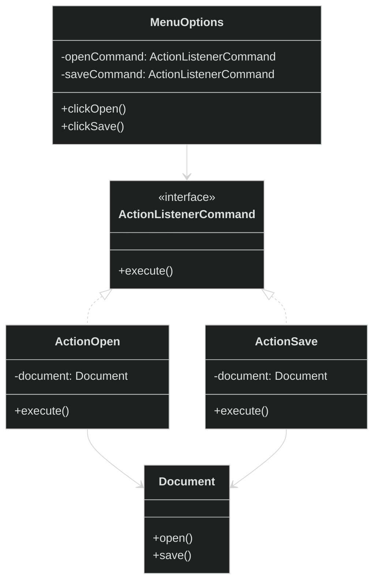
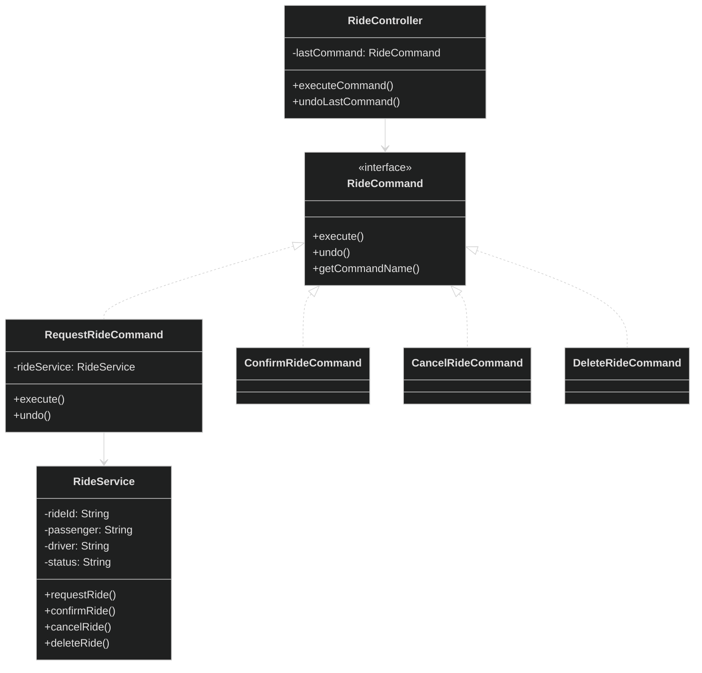

# Command Design Pattern - Implementation Showcase

<div style="background-color: #1e1e1e; padding: 20px; border-radius: 8px; color: #e0e0e0;">

## 🏗️ Overview
This directory contains two implementations of the Command design pattern:
1. **Basic Implementation** (`command_pattern_impl.java`): A simple document editor example
2. **Advanced Implementation** (`uber_command_pattern.java`): A feature-rich Uber ride management system with undo functionality

## 📁 File Structure
```
Day06/
└── Command DP/
    ├── command_pattern_impl.java  # Basic implementation
    └── uber_command_pattern.java  # Advanced implementation with undo/redo
    └── README.md                 # This file
```

## 📊 Basic Implementation: Document Editor

### Architecture


### Key Components
- **Document**: The receiver that performs the actual operations
- **ActionListenerCommand**: Command interface
- **ActionOpen/ActionSave**: Concrete commands
- **MenuOptions**: The invoker that triggers commands

## 🚗 Advanced Implementation: Uber Ride System

### Architecture


### Key Features
1. **Command Interface with Undo**
   ```java
   interface RideCommand {
       void execute();
       void undo();
       String getCommandName();
   }
   ```

2. **Concrete Commands**
   - `RequestRideCommand`: Handles ride requests
   - `ConfirmRideCommand`: Confirms ride with a driver
   - `CancelRideCommand`: Cancels an active ride
   - `DeleteRideCommand`: Removes a ride from history

3. **RideController (Invoker)**
   - Manages command execution
   - Supports undo functionality
   - Tracks command history

## 🎯 When to Use
- Need to decouple sender and receiver
- Need to support undo/redo operations
- Need to queue requests
- Need to log requests

## ✅ Pros
- Decouples the invoker from the receiver
- Easy to add new commands
- Supports undo/redo operations
- Commands can be queued or logged

## ❌ Cons
- Can lead to many command classes
- May complicate simple operations

## 🌟 Key Differences
| Feature | Basic Implementation | Advanced Implementation |
|---------|----------------------|-------------------------|
| Undo/Redo | ❌ No | ✅ Yes |
| Command History | ❌ No | ✅ Yes |
| Complex State | ❌ No | ✅ Yes |
| Multiple Receivers | ❌ Single | ✅ Multiple |
| Use Case | Simple UI actions | Complex business logic |

## 📝 Example Usage (Advanced)
```java
// Create services and controller
RideService rideService = new RideService();
RideController controller = new RideController();

// Request a ride
RideCommand requestCmd = new RequestRideCommand(
    rideService, "RIDE123", "John", "123 Main St", "456 Park Ave"
);
controller.executeCommand(requestCmd);

// Confirm the ride
RideCommand confirmCmd = new ConfirmRideCommand(rideService, "Alice");
controller.executeCommand(confirmCmd);

// Undo last action
controller.undoLastCommand();
```

## 🛠️ Running the Examples
1. **Basic Implementation**:
   ```bash
   javac command_pattern_impl.java
   java DocumentDemo
   ```

2. **Advanced Implementation**:
   ```bash
   javac uber_command_pattern.java
   java UberRideSystem
   ```

</div>

<style>
  body {
    background-color: #1e1e1e;
    color: #e0e0e0;
  }
  h1, h2, h3, h4, h5, h6 {
    color: #4ec9b0;
  }
  code {
    background-color: #2d2d2d;
    color: #d4d4d4;
  }
  pre {
    background-color: #2d2d2d;
    border-radius: 4px;
    padding: 12px;
  }
  table {
    border-collapse: collapse;
    width: 100%;
    margin: 15px 0;
  }
  th, td {
    border: 1px solid #444;
    padding: 8px;
    text-align: left;
  }
  th {
    background-color: #2d2d2d;
  }
  tr:nth-child(even) {
    background-color: #252525;
  }
</style>
