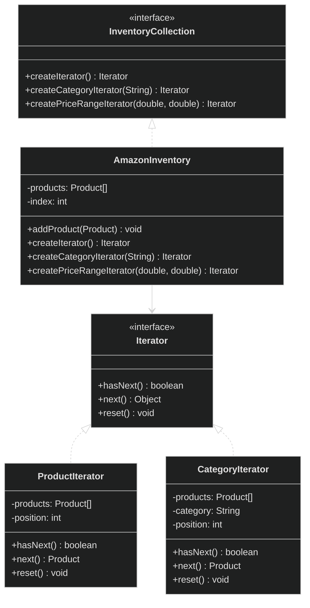

# Iterator Design Pattern

<div style="background-color: #1e1e1e; padding: 20px; border-radius: 8px; color: #e0e0e0;">

## 🏗️ Overview
The Iterator pattern provides a way to access the elements of a collection object in sequential manner without exposing its underlying representation. It decouples the collection from the algorithm used to traverse it.

## 📊 Architecture



## 🎯 When to Use
- When you need to traverse different data structures uniformly
- When you want to hide the internal structure of a collection
- When you need multiple ways to traverse the same collection
- When you want to provide a clean interface for iterating over a collection

## ✅ Pros
- Single Responsibility Principle: Separates traversal logic from the collection
- Open/Closed Principle: New iterator types can be added without changing the collection
- Can iterate over the same collection in parallel
- Can pause iteration and resume later

## ❌ Cons
- Can be overkill for simple collections
- May be less efficient than direct traversal for simple cases

## 🔍 Real-world Analogy
Think of browsing through an Amazon product catalog where you can view all products, filter by category, or search by price range - all using the same interface without knowing how the products are stored internally.

## 🛠️ Implementation Details
- `Iterator` interface defines the traversal operations
- Concrete iterators implement specific traversal algorithms
- `InventoryCollection` interface declares factory methods for creating iterators
- `AmazonInventory` implements the collection and creates appropriate iterators

## 📝 Example Usage
```java
// Create inventory and add products
AmazonInventory inventory = new AmazonInventory();
inventory.addProduct(new Product("P1", "Laptop", 999.99, "Electronics", 10));
inventory.addProduct(new Product("P2", "Smartphone", 699.99, "Electronics", 20));
inventory.addProduct(new Product("P3", "Book", 19.99, "Books", 50));

// Get different types of iterators
Iterator allProducts = inventory.createIterator();
Iterator electronics = inventory.createCategoryIterator("Electronics");
Iterator affordable = inventory.createPriceRangeIterator(0, 100);

// Use the iterators
System.out.println("All Products:");
while (allProducts.hasNext()) {
    Product p = (Product) allProducts.next();
    System.out.println("- " + p.getName());
}

System.out.println("\nElectronics:");
while (electronics.hasNext()) {
    Product p = (Product) electronics.next();
    System.out.println("- " + p.getName() + " ($" + p.getPrice() + ")");
}
```

## 🌟 Key Points
- Decouples collection from traversal logic
- Supports multiple simultaneous traversals
- Follows Single Responsibility and Open/Closed principles
- Provides a uniform interface for different types of collections

</div>

<style>
  body {
    background-color: #1e1e1e;
    color: #e0e0e0;
  }
  h1, h2, h3, h4, h5, h6 {
    color: #4ec9b0;
  }
  code {
    background-color: #2d2d2d;
    color: #d4d4d4;
  }
  pre {
    background-color: #2d2d2d;
    border-radius: 4px;
    padding: 12px;
  }
</style>
