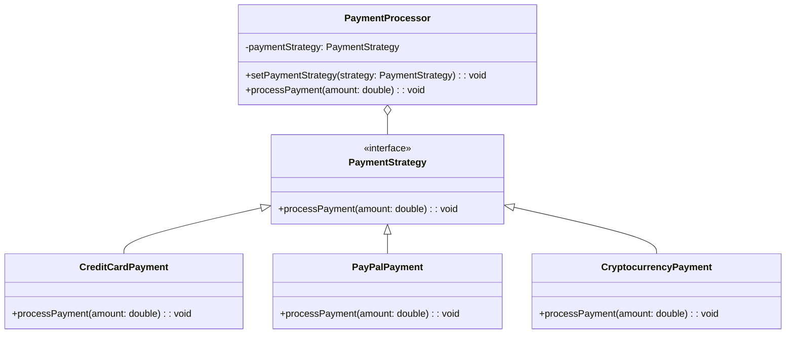
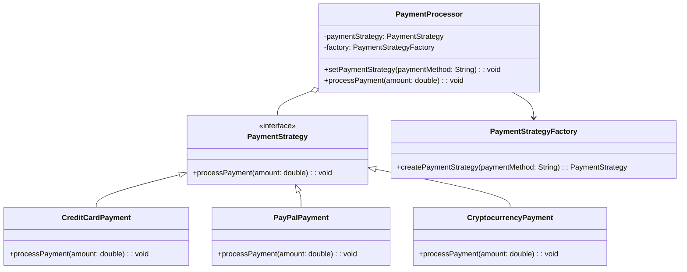
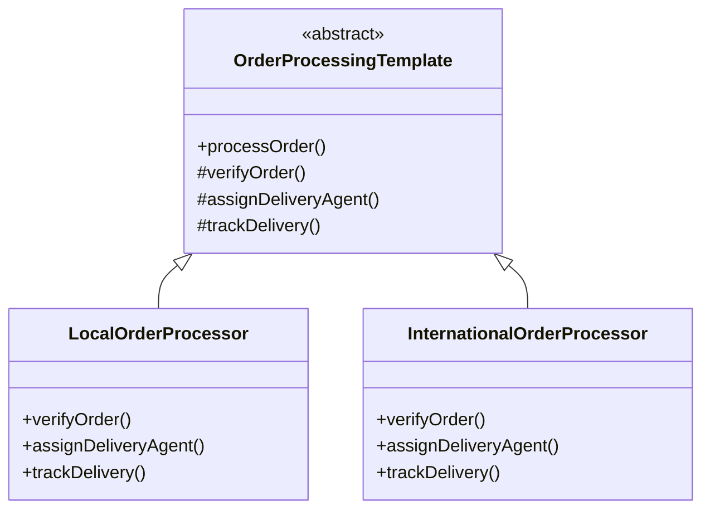
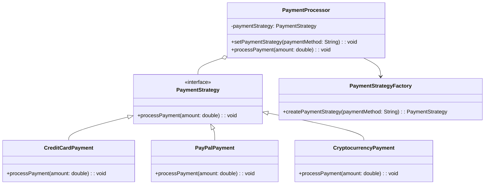

# Design Patterns: Strategy, Strategy with Factory, and Template Method

This directory contains implementations of three design patterns in Java:
1. Strategy Pattern
2. Strategy Pattern with Factory
3. Template Method Pattern

## Strategy Design Pattern

### Overview
The Strategy pattern defines a family of algorithms, encapsulates each one, and makes them interchangeable. It lets the algorithm vary independently from clients that use it.

### Class Diagram


### Implementation Details
The Strategy pattern is implemented with the following components:
- `PaymentStrategy`: Interface that defines the contract for all payment strategies
- Concrete strategies: `CreditCardPayment`, `PayPalPayment`, `CryptocurrencyPayment`
- `PaymentProcessor`: Context class that uses a strategy to process payments

### Usage
```java
PaymentProcessor processor = new PaymentProcessor();

// Set and use CreditCard payment
PaymentStrategy strategy = new CreditCardPayment();
processor.setPaymentStrategy(strategy);
processor.processPayment(100.0);

// Change to PayPal payment
strategy = new PayPalPayment();
processor.setPaymentStrategy(strategy);
processor.processPayment(50.0);
```

### When to Use
- When you need to select an algorithm at runtime
- When you have multiple related classes that only differ in their behavior
- When you want to avoid conditional statements for selecting algorithms
- When you want to hide the implementation details of algorithms from clients

## Strategy + Factory Design Pattern

### Overview
This combines the Strategy pattern with the Factory pattern to create strategy objects. The Factory pattern encapsulates the object creation logic, making the client code cleaner and more maintainable.

### Class Diagram


### Implementation Details
The combined pattern adds:
- `PaymentStrategyFactory`: Creates appropriate strategy instances based on input
- Modified `PaymentProcessor` that works with the factory
- The client code no longer needs to know about concrete strategy implementations

### Usage
```java
PaymentProcessor processor = new PaymentProcessor();

// Use factory to create and set payment strategy
processor.setPaymentStrategy("CreditCard");
processor.processPayment(100.0);

// Change payment method using factory
processor.setPaymentStrategy("PayPal");
processor.processPayment(50.0);
```

### Benefits
1. **Decoupling**: Client code is decoupled from concrete strategy classes
2. **Flexibility**: Easy to add new payment methods without changing existing code
3. **Maintainability**: Object creation logic is centralized in the factory
4. **Testability**: Strategies can be easily mocked and tested in isolation

### When to Use
- When you want to hide the creation logic of strategies from the client
- When the creation of strategy objects is complex or conditional
- When you want to centralize the object creation code
- When you need to manage the lifecycle of strategy objects

## Template Method Design Pattern

### Overview
The Template Method pattern defines the skeleton of an algorithm in a method, deferring some steps to subclasses. It lets subclasses redefine certain steps of an algorithm without changing the algorithm's structure.

### Class Diagram


### Implementation Details
- **OrderProcessingTemplate**: Abstract class that defines the template method `processOrder()` and declares abstract methods for each step.
- **LocalOrderProcessor**: Concrete implementation for processing local orders.
- **InternationalOrderProcessor**: Concrete implementation for processing international orders.

### Usage
```java
public class AmazonOrderProcessor {
    public static void main(String[] args) {
        // Process a local order
        OrderProcessingTemplate localOrder = new LocalOrderProcessor();
        System.out.println("Processing a local order:");
        localOrder.processOrder();

        // Process an international order
        OrderProcessingTemplate internationalOrder = new InternationalOrderProcessor();
        System.out.println("\nProcessing an international order:");
        internationalOrder.processOrder();
    }
}
```

### Benefits
1. **Code Reuse**: Common behavior is defined once in the abstract class
2. **Flexibility**: Subclasses can override specific steps without changing the algorithm's structure
3. **Maintainability**: Changes to the algorithm's structure only need to be made in one place
4. **Control**: The parent class controls the overall process flow

### When to Use
- When you want to let clients extend only particular steps of an algorithm
- When you have several classes that contain almost identical algorithms with some minor differences
- When you need to control the point at which subclasses can override the algorithm's steps
- When you want to avoid code duplication in multiple classes that have similar behavior

### Class Diagram


### Implementation Details
The Strategy pattern is implemented with the following components:
- `PaymentStrategy`: Interface that defines the contract for all payment strategies
- Concrete strategies: `CreditCardPayment`, `PayPalPayment`, `CryptocurrencyPayment`
- `PaymentProcessor`: Context class that uses a strategy to process payments

### Usage
```java
PaymentProcessor processor = new PaymentProcessor();

// Set and use CreditCard payment
PaymentStrategy strategy = new CreditCardPayment();
processor.setPaymentStrategy(strategy);
processor.processPayment(100.0);

// Change to PayPal payment
strategy = new PayPalPayment();
processor.setPaymentStrategy(strategy);
processor.processPayment(50.0);
```

## Strategy + Factory Design Pattern

### Overview
This combines the Strategy pattern with the Factory pattern to create strategy objects. The Factory pattern encapsulates the object creation logic, making the client code cleaner and more maintainable.

### Class Diagram


### Implementation Details
The combined pattern adds:
- `PaymentStrategyFactory`: Creates appropriate strategy instances based on input
- Modified `PaymentProcessor` that works with the factory

### Usage
```java
PaymentProcessor processor = new PaymentProcessor();

// Use factory to create and set payment strategy
processor.setPaymentStrategy("CreditCard");
processor.processPayment(100.0);

// Change payment method using factory
processor.setPaymentStrategy("PayPal");
processor.processPayment(50.0);
```

## Benefits of Using Strategy + Factory Pattern
1. **Decoupling**: Client code is decoupled from concrete strategy classes
2. **Flexibility**: Easy to add new payment methods without changing existing code
3. **Maintainability**: Object creation logic is centralized in the factory
4. **Testability**: Strategies can be easily mocked and tested in isolation

## When to Use
- When you need to select an algorithm at runtime
- When you have multiple related classes that only differ in their behavior
- When you want to avoid conditional statements for selecting algorithms
- When you want to hide the implementation details of strategies from clients
