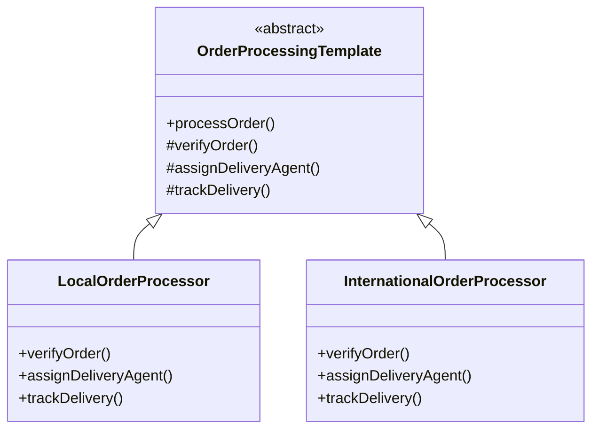

# Template Method Design Pattern

## Overview
The Template Method is a behavioral design pattern that defines the skeleton of an algorithm in a method, deferring some steps to subclasses. It lets subclasses redefine certain steps of an algorithm without changing the algorithm's structure.

## Problem
In the context of Amazon's order processing system, different types of orders (local vs. international) require similar processing steps but with different implementations for each step.

## Solution
The Template Method pattern suggests breaking down the algorithm into a series of steps, turning these steps into methods, and putting a series of calls to these methods inside a single template method. The steps may be either abstract or have some default implementation.

## Class Diagram


## Implementation Details
- `OrderProcessingTemplate`: Abstract class that defines the template method `processOrder()` and declares abstract methods for each step.
- `LocalOrderProcessor`: Concrete implementation for processing local orders.
- `InternationalOrderProcessor`: Concrete implementation for processing international orders.

## Usage
```java
public class AmazonOrderProcessor {
    public static void main(String[] args) {
        // Process a local order
        OrderProcessingTemplate localOrder = new LocalOrderProcessor();
        System.out.println("Processing a local order:");
        localOrder.processOrder();

        // Process an international order
        OrderProcessingTemplate internationalOrder = new InternationalOrderProcessor();
        System.out.println("\nProcessing an international order:");
        internationalOrder.processOrder();
    }
}
```

## Benefits
- Code Reuse: Common behavior is defined once in the abstract class.
- Flexibility: Subclasses can override specific steps without changing the algorithm's structure.
- Maintainability: Changes to the algorithm's structure only need to be made in one place.

## When to Use
- When you want to let clients extend only particular steps of an algorithm.
- When you have several classes that contain almost identical algorithms with some minor differences.
- When you need to control the point at which subclasses can override the algorithm's steps.
