# Low-Level System Design

## 📚 Overview
This repository is a comprehensive collection of Low-Level System Design patterns, case studies, and best practices. It's designed to help you prepare for system design interviews and build robust, scalable systems in real-world scenarios.

## 🎯 Purpose
- Understand fundamental system design concepts and patterns
- Learn through practical case studies of popular systems
- Prepare for system design interviews with real-world examples
- Implement best practices for building scalable and maintainable systems

## 📂 Repository Structure

```mermaid
graph TD
    %% Main Repository Structure
    A[LL-System-Design] --> B[Video-Player/]
    A --> C[Day01/]
    A --> D[Day02/]
    A --> E[Day03/]
    A --> F[Day04/]
    A --> G[Day05/]
    
    %% Video-Player Structure
    B --> B1[Code/]
    B1 --> B11[VideoPlayer.java]
    B1 --> B12[README.md]
    B --> B2[Video-Player.pdf]
    
    %% Day01 Structure
    C --> C1[Polymorphism/]
    C1 --> C11[SwiggyPolymorphism.java]
    C1 --> C12[README.md]
    C1 --> C13[Explanation.txt]
    
    C --> C2[SOLID Principals/]
    C2 --> C21[SwiggySOLID.java]
    C2 --> C22[README.md]
    
    C --> C3[Day01.pdf]

    %% Day02 Structure
    D --> D1[UML Diagram.pdf]
    D --> D2[Day02.pdf]
    
    %% Day03 Structure (Design Patterns)
    E --> E1[Abstract Factory/]
    E1 --> E11[AbstractFactorySwiggy.java]
    E1 --> E12[README.md]
    
    E --> E2[Factory Method/]
    E2 --> E21[FactoryMethodSwiggy.java]
    E2 --> E22[README.md]
    
    E --> E3[Simple Factory/]
    E3 --> E31[SimpleFactorySwiggy.java]
    E3 --> E32[README.md]
    
    E --> E4[Day03.pdf]
    
    %% Day04 Structure (Design Patterns)
    F --> F1[Singleton DP/]
    F1 --> F11[AppConfigDemo.java]
    F1 --> F12[README.md]
    
    F --> F2[Builder DP/]
    F2 --> F21[VehicleBuilderDemo.java]
    F2 --> F22[README.md]
    
    F --> F3[Factory DP/]
    F3 --> F31[VehicleFactoryDemo.java]
    F3 --> F32[README.md]
    
    F --> F4[Prototype DP/]
    F4 --> F41[VehiclePrototypeDemo.java]
    F4 --> F42[README.md]
    
    F --> F5[Day04.pdf]
    
    %% Day05 Structure (Behavioral Patterns)
    G --> G1[Command DP/]
    G1 --> G11[CommandPatternDemo.java]
    G1 --> G12[README.md]
    
    G --> G2[Observer DP/]
    G2 --> G21[ObserverPatternDemo.java]
    G2 --> G22[README.md]
    
    G --> G3[Day05.pdf]
    
    %% Root Level Files
    A --> A1[README.md]
    A --> A2[LICENSE]
    
    %% Styling
    classDef folder fill:#2b2b2b,stroke:#4a4a4a,color:#e0e0e0,stroke-width:2px
    classDef file fill:#1e3a8a,stroke:#3b82f6,color:#e0e0e0,stroke-width:2px
    classDef doc fill:#1e3a1e,stroke:#10b981,color:#e0e0e0,stroke-width:2px
    classDef readme fill:#5b21b6,stroke:#8b5cf6,color:#e0e0e0,stroke-width:2px
    classDef license fill:#9d174d,stroke:#ec4899,color:#e0e0e0,stroke-width:2px
    
    %% Apply styles
    class A,B1,C1,C2,E1,E2,E3,F1,F2,F3,F4,G1,G2 folder
    class B11,B12,C11,C12,C13,C21,C22,E11,E12,E21,E22,E31,E32,F11,F12,F21,F22,F31,F32,F41,F42,G11,G12,G21,G22 file
    class B2,C3,D1,D2,E4,F5,G3 doc
    class A1 readme
    class A2 license
```


| Day | Topic | 
|-----|-------|
| 00  | [Basic Video Player System Design](Video-Player/) |
| 01  | [OOPs & SOLID Principles](Day01/) |
| 02  | [UML Diagram & Types of Design Patterns](Day02/) |
| 03  | [Factory Design Patterns](Day03/) |
| 04  | [Builder, Factory, Singleton & Prototype Design Patterns](Day04/) |
| 05  | [Behavioral Design Patterns - Command & Observer](Day05/) |

## 🚀 Getting Started


1. **Clone the repository**
   ```bash
   git clone https://github.com/Shree2604/LL-System-Design.git
   cd LL-System-Design
   ```

2. **Explore different design patterns** and case studies
3. **Study the implementation details** in the code
4. **Try to implement your own solutions** before looking at the provided ones
5. **Compare** your solutions with the provided implementations

## 🤝 Contributing
Contributions are welcome! Please feel free to submit a Pull Request.

## 📄 License
This project is licensed under the MIT License - see the [LICENSE](LICENSE) file for details.
