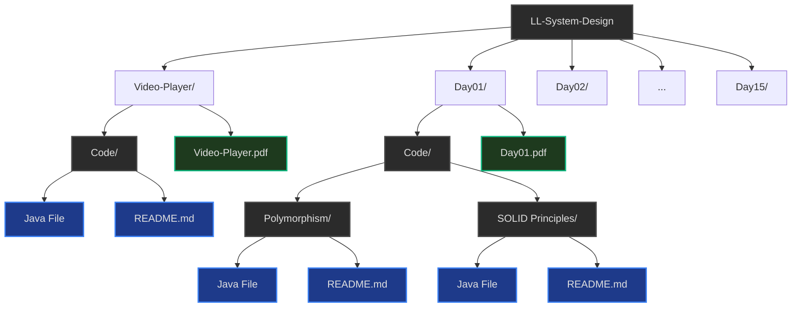
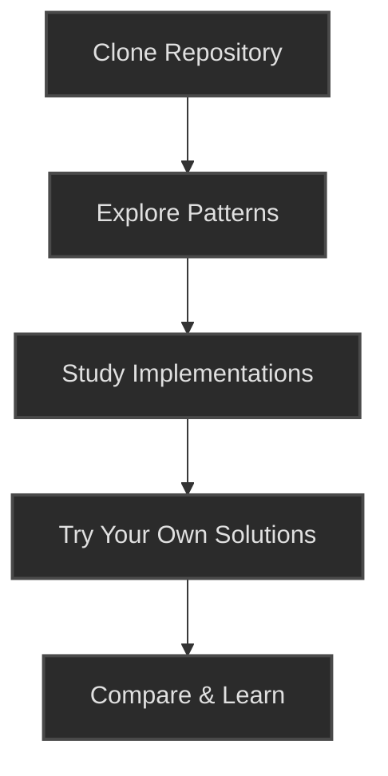

# Low-Level System Design

## 📚 Overview
This repository is a comprehensive collection of Low-Level System Design patterns, case studies, and best practices. It's designed to help you prepare for system design interviews and build robust, scalable systems in real-world scenarios.

## 🎯 Purpose
- Understand fundamental system design concepts and patterns
- Learn through practical case studies of popular systems
- Prepare for system design interviews with real-world examples
- Implement best practices for building scalable and maintainable systems

## 📂 Repository Structure


## 📅 Daily Progress

```mermaid
gantt
    title Project Timeline
    dateFormat  YYYY-MM-DD
    axisFormat %b %d
    
    section Completed
    Video Player     :done, des1, 2025-12-15, 3d
    OOPs & SOLID     :done, des2, 2025-12-18, 2d
    
    section In Progress
    System Design Basics :active, des3, 2025-12-19, 5d
    
    section Upcoming
    Advanced Patterns    : des4, after des3, 5d
    Real-world Systems   : des5, after des4, 5d
    
    %% Styling - Note: Gantt charts have limited styling in Mermaid
    %% We'll use task states for theming
    class des1,des2 done
    class des3 active
    class des4,des5 critical
```

| Day | Topic | Status |
|-----|-------|--------|
| 00  | [Basic Video Player System Design](#) | ✅ Completed |
| 01  | [OOPs & SOLID Principles](#) | ✅ Completed |

## 🚀 Getting Started



1. **Clone the repository**
   ```bash
   git clone https://github.com/yourusername/LL-System-Design.git
   cd LL-System-Design
   ```

2. **Explore different design patterns** and case studies
3. **Study the implementation details** in the code
4. **Try to implement your own solutions** before looking at the provided ones
5. **Compare** your solutions with the provided implementations

## 🤝 Contributing
Contributions are welcome! Please feel free to submit a Pull Request.

## 📄 License
This project is licensed under the MIT License - see the [LICENSE](LICENSE) file for details.
