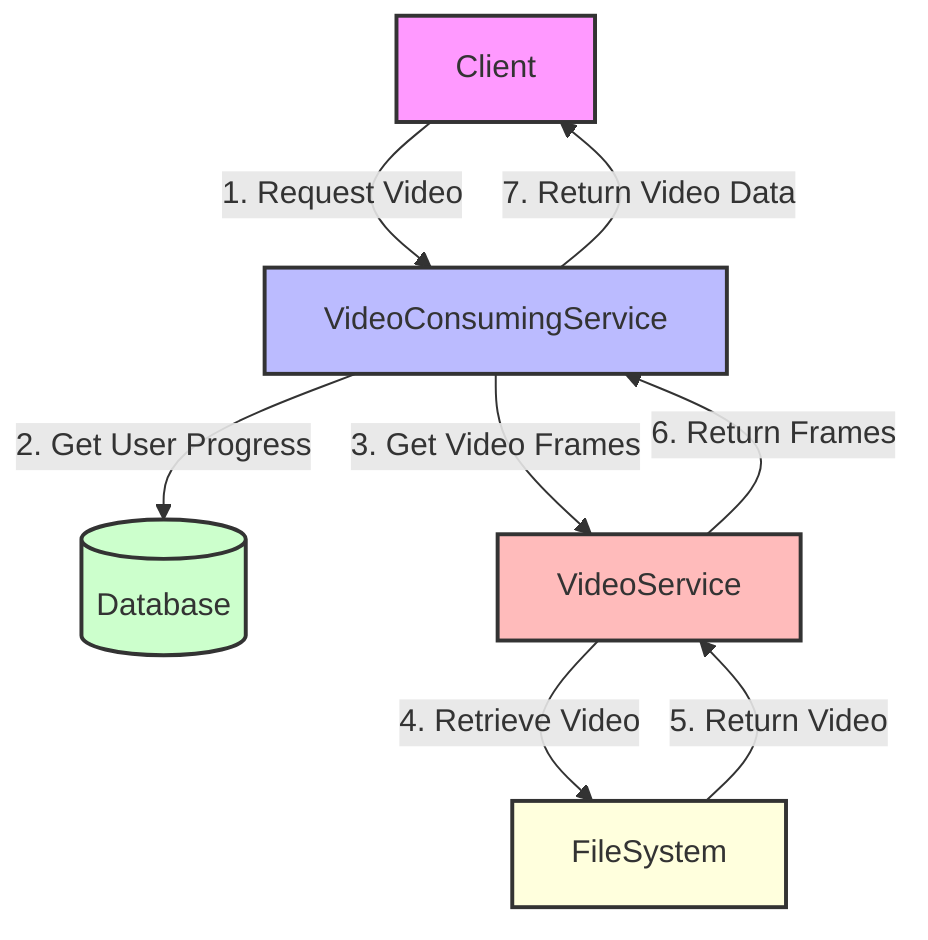
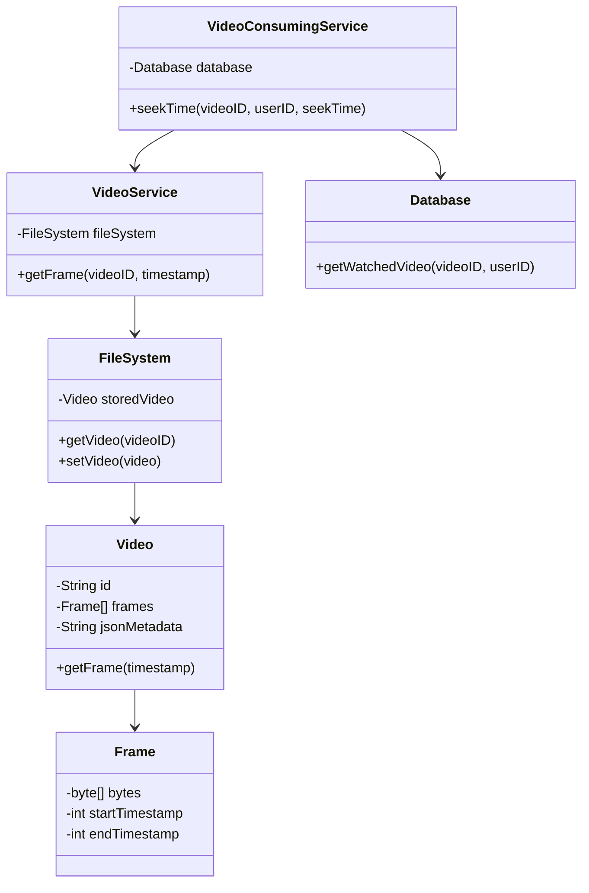
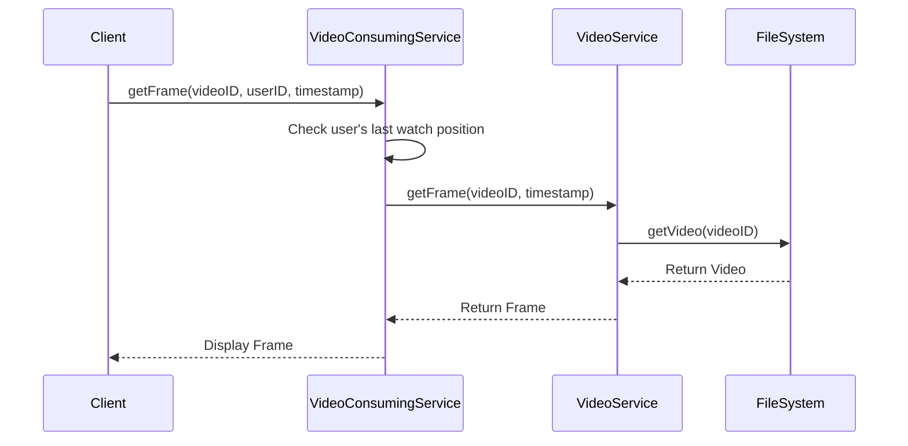

# Video Player System - Code Architecture

## System Architecture

## Component Interactions

### 1. Client
- **Role**: Initiates video playback requests
- **Responsibilities**:
  - Display video frames
  - Handle user interactions (play, pause, seek)
  - Manage video player UI

### 2. VideoConsumingService
- **Role**: Main service orchestrator
- **Key Methods**:
  - `seekTime(videoID, userID, seekTime)`: Updates watch progress
  - `getVideoData(videoID, userID)`: Retrieves video data with user's progress

### 3. Database
- **Role**: Persistent storage for user data
- **Stores**:
  - User watch history
  - Video progress
  - User preferences

### 4. VideoService
- **Role**: Video processing layer
- **Key Methods**:
  - `getFrame(videoID, timestamp)`: Retrieves specific video frame
  - `getVideoMetadata(videoID)`: Gets video details

### 5. FileSystem
- **Role**: Raw video storage
- **Responsibilities**:
  - Store video files
  - Efficiently retrieve video segments
  - Handle file operations

## Data Flow

### Video Playback Initialization
1. Client requests video with user ID and video ID
2. VideoConsumingService checks user's last watch position
3. VideoService loads video from FileSystem
4. Frames are processed and streamed to client
5. Playback starts from last position (if any)

### Seek Operation
1. User seeks to new position
2. Client sends seek request with timestamp
3. VideoConsumingService updates user's progress
4. VideoService loads and returns frames from new position

## Class Diagram

## Sequence Diagram: Frame Retrieval

## Performance Considerations

1. **Caching**:
   - Cache frequently accessed frames
   - Implement LRU cache for recently watched videos

2. **Lazy Loading**:
   - Load frames on demand
   - Preload next few seconds of video

3. **Concurrency**:
   - Handle multiple simultaneous users
   - Thread-safe operations for shared resources

## Error Handling

1. **Video Not Found**: Return appropriate error to client
2. **Invalid Timestamp**: Return nearest valid frame
3. **Database Errors**: Implement retry mechanism
4. **File System Errors**: Graceful degradation of service